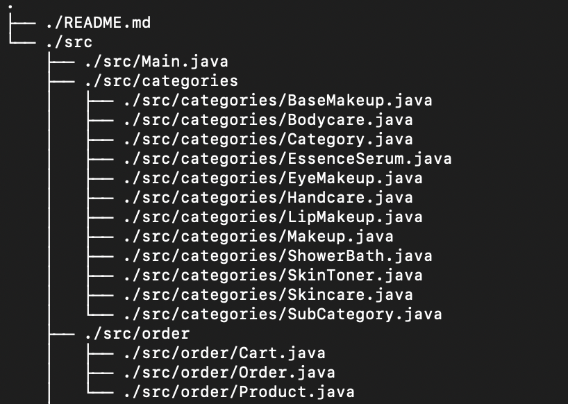
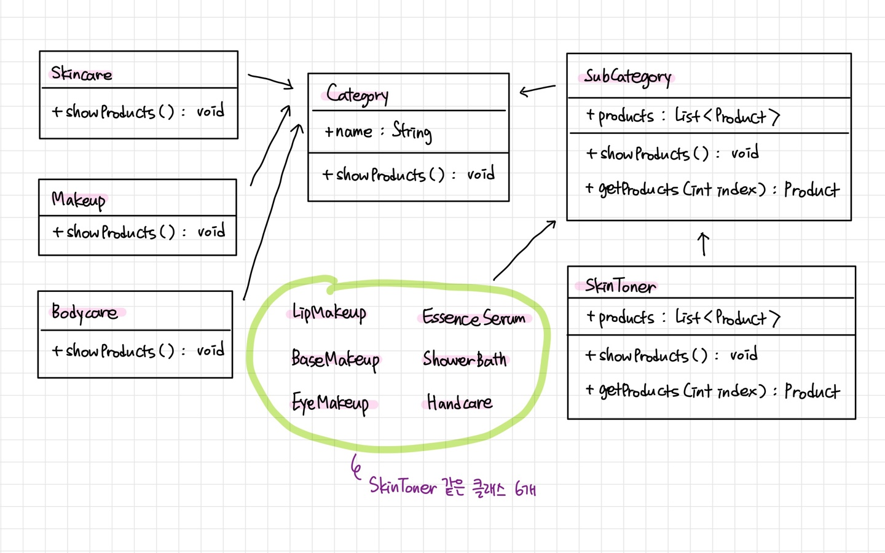
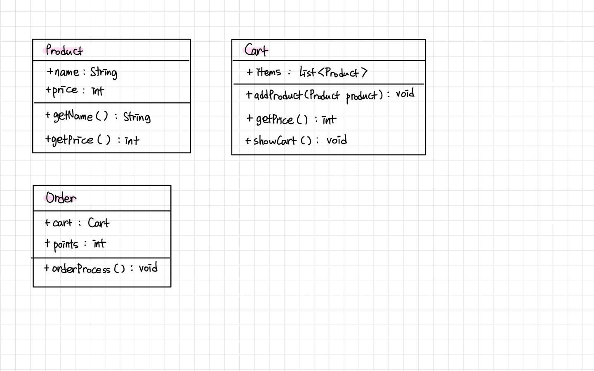

# 🛍️ 올리브영 온라인 주문 CLI Program

> 카카오 부트캠프 풀스택 1차 과제

본 프로그램은 콘솔 환경에서 올리브영 제품을 주문해보는 Java 기반 프로그램입니다.

## 프로젝트 개요
- **개발 언어** : Java
- **기능**
  - 카테고리 및 하위 카테고리 선택
  - 제품 선택 및 장바구니 담기
  - 배송 방법 선택
  - 포인트 사용 및 결제

## 프로젝트 폴더 구조

## 실행 방법
1. src 폴더로 이동
2. 컴파일 : `javac -d out Main.java`
3. 실행 : `java -cp out Main`

## 클래스 설명
| 클래스                              | 설명                          |
|----------------------------------|-----------------------------|
| `Category`                        | 최상위 카테고리 클래스 (추상 클래스)       |
| `SubCategory`                     | 1차 하위 카테고리                  |
| `Skincare`, `Makeup`, `Bodycare`      | 하위 카테고리 클래스                 |
| `SkinToner`, `EssenceSerum`         | Skincare의 세부 카테고리 (2차 상속)   |
| `LipMakeup`, `BaseMakeup`, `EyeMakeup` | Makeup의 세부 카테고리 (2차 상속)     |
| `ShowerBath`, `Handcare`            | Bodycare의 세부 카테고리 (2차 상속)   |
| `Product`                          | 제품 정보 (제품명, 가격)             |
| `Cart`                            | 장바구니 관리 (제품 추가, 총 제품 금액 계산) |
| `Order`                            | 배송 방법 선택, 포인트 사용, 결제 기능 포함  |
| `Main`                             | 프로그램 실행 및 사용자 입력 처리         |

- 클래스 다이어그램

  
  

## 실행 화면

## 회고
- 개발 전 클래스 다이어그램을 그리는 것이 매우 중요하다는 것을 깨달았다.
- 하위 카테고리를 많이 생성해보니 클래스 상속이 코드 중복을 많이 줄여준다는 것을 느꼈다.
- 어려웠던 부분 : 추상클래스 Category 상속 받는 추상클래스 SubCategory 생성하기
  - Category와 SubCategory라는 추상클래스를 만들고 각각을 상속받는 클래스들을 생성하는 것이 효율적이다.
  - 다양한 상위.하위 카테고리에 대해 사용자의 입력에 따라 제품명을 출력하는 것이 어려웠다.
  - `SubCategory subCategory = null;`로 초기화하여 switch-case문에 활용하니 수월했다.
- 개선점
  - Order 클래스의 orderProcess() 메서드 안에 너무 많은 기능을 넣은 것 같다.
  - 배송방법 선택 / 포인트 사용 여부 확인 / 최종 금액 산출 / 결제 기능을 4개의 메서드로 분리하는 것이 더 효율적일 것 같다.
  - 수량 선택 기능, 장바구니에 추가할지 한번 더 확인하는 기능 등을 추가로 구현하면 더 편리할 것 같다.