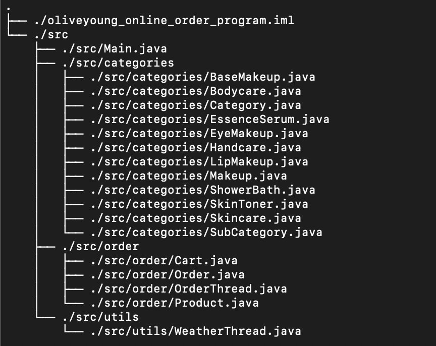
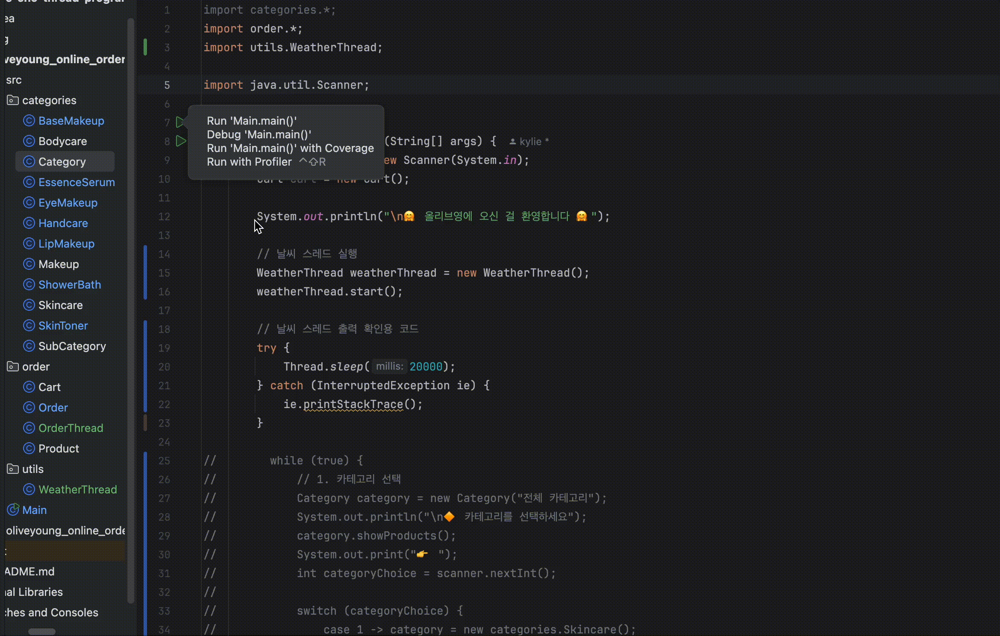

# 🛍️ 올리브영 온라인 주문 CLI Thread Program

> 카카오 부트캠프 풀스택 2차 과제

본 프로그램은 콘솔 환경에서 올리브영 제품을 주문해보는 Java 기반 프로그램입니다.

Thread를 활용한 비동기 프로그램으로 만들어 비가 오거나 눈이 오면 추가 할인을 받을 수 있습니다.

## 프로젝트 개요
- **개발 언어** : Java
- **기능**
  - 카테고리 및 하위 카테고리 선택
  - 제품 선택 및 장바구니 담기
  - **[추가]** 날씨 확인 및 할인율 적용
  - 배송 방법 선택
  - 포인트 사용 및 결제

## 프로젝트 폴더 구조

## 실행 방법
1. src 폴더로 이동
2. 컴파일 : `javac -d out Main.java`
3. 실행 : `java -cp out Main`

## 클래스 설명
| 클래스                              | 설명                      |
|----------------------------------|-------------------------|
| `Category`                        | 최상위 카테고리 클래스 (추상 클래스)   |
| `SubCategory`                     | 1차 하위 카테고리              |
| `Skincare`, `Makeup`, `Bodycare`      | 하위 카테고리 클래스             |
| `SkinToner`, `EssenceSerum`         | Skincare의 세부 카테고리 (2차 상속) |
| `LipMakeup`, `BaseMakeup`, `EyeMakeup` | Makeup의 세부 카테고리 (2차 상속) |
| `ShowerBath`, `Handcare`            | Bodycare의 세부 카테고리 (2차 상속) |
| `Product`                          | 제품 정보 (제품명, 가격)         |
| `Cart`                            | 장바구니 관리 (제품 추가, 총 제품 금액 계산) |
| `Order`                            | 배송 방법 선택, 포인트 사용, 결제 기능 포함 |
| `Main`                             | 프로그램 실행 및 사용자 입력 처리     |
| `WeatherThread` | 날씨 정보 주기적으로 변경          |
| `OrderThread` | 현재 날씨 확인 및 할인율 적용       |

## 스레드 기능 추가 및 변경사항
### 날씨 스레드 구현

- Thread 클래스 상속
- ‘맑음 → 흐림 → 비 내림 → 눈 내림’ 반복
- 날씨 스레드 2초마다 결과 변경 → 20초 동안 실행 결과 확인

### 주문 스레드 구현

- Thread 클래스 상속
- 비 오면 총 제품 가격에서 10% 할인
- 눈 오면 총 제품 가격에서 20% 할인

### Order 클래스 수정

- 날씨 할인 적용가 + 배달비 + 포인트 적용 → 최종 결제 금액
- getCart() 메서드 추가
  - 장바구니에 담긴 총 제품 가격을 가져오는 메서드
- applyDiscount() 메서드 추가
  - OrderThread에서 날씨 할인이 적용된 후 총 제품 가격을 가져오는 메서드

### 전체 프로그램 흐름

1. 날씨 스레드 실행
2. 사용자 쇼핑
3. 주문 스레드 실행
4. 배송비 및 포인트 포함한 최종 결제 금액 고지
5. 결제
6. 스레드 종료

## 실행 화면
1. 간단한 날씨 스레드 구현

 

2. 맑거나 흐려 할인율 미적용

 

3. 비가 내려 할인율 10% 적용

 

4. 눈이 내려 할인율 20% 적용

## 회고
- 기능 분리를 잘 해둬서 기능 추가에 따라 기존 클래스 중 하나의 클래스만 수정해도 됐던 것이 뿌듯했다.
- 어려웠던 점 1. Order 클래스에서 총 제품 가격 관련 부분 수정하기
    - Order 클래스에서 기존 가격을 가져오고, 날씨 할인 후 가격을 받아와야 했다.
    - 특히 Order에서 getCart()를 작성하고, OrderThread에서 `order.getCart().getPrice()`로 총 제품 가격을 가져오는 부분이 조금 헷갈렸다.
- 어려웠던 점 2. .gitignore 파일 추가하기
  - .idea/ 와 out/ 폴더는 깃허브에 올리지 않는 것이 좋다고 하여 이미 올린 것을 삭제하고 추적을 해제하는 과정에서 오류가 났다.
  - 로컬에서 프로젝트 폴더가 보이지 않는 오류였는데 처음 겪는 오류라 해결하는데 시간이 꽤나 걸렸다.
- 개선점
  - 날씨 할인이 전 제품이 아닌 특정 품목으로 한정되면 더 현실적일 것 같다.
  - 재고 관련 속성을 추가하면 스레드를 활용한 품절 기능도 추가할 수 있을 것 같다.